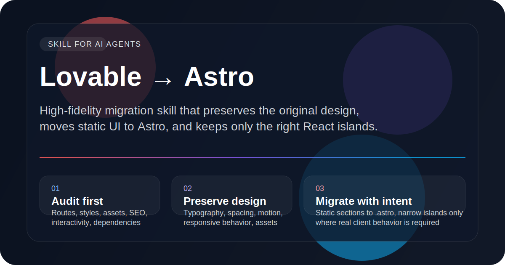

# Lovable → Astro Migration

<p align="center">
  
</p>

<p align="center">
  <a href="https://skills.sh"></a>
  
  
  
</p>

High-fidelity AI skill for migrating **Lovable-generated React/Tailwind/Vite projects** into **Astro** without flattening the design, over-hydrating the app, or turning the migration into a generic rewrite.

This skill is built for the real workflow:

- audit the source first,
- preserve the original visual language,
- convert static UI to `.astro`,
- keep only the necessary interactive React islands,
- finish with a coherent Astro architecture.

---

## Why this skill exists

Most Lovable → Astro migrations fail for predictable reasons:

- the design gets “cleaned up” and loses its character,
- static sections stay in React because it is easier,
- the whole page gets hydrated,
- Tailwind/theme details disappear,
- the result works technically but no longer feels like the original product.

This skill exists to prevent exactly that.

## What the skill teaches the agent to do

- **Audit before editing**: routes, components, assets, styling, metadata, dependencies, and interactivity.
- **Preserve design fidelity**: spacing, typography, colors, gradients, shadows, responsive behavior, animations, and content hierarchy.
- **Choose the correct Astro target shape**: pages, layouts, `.astro` components, and narrowly scoped React islands.
- **Avoid migration anti-patterns**: whole-page hydration, accidental redesigns, broken asset paths, and React leftovers in Astro code.
- **Deliver implementation, not essays**: unless the user explicitly asks for strategy only.

## Ideal trigger situations

Use this skill when the user says things like:

- “Migrate this Lovable repo to Astro.”
- “Preserve the Lovable design but move the project to Astro.”
- “Convert this React + Tailwind + Vite export from Lovable into Astro.”
- “I already have an Astro project — merge this Lovable design into it.”
- “Keep the exact look, but reduce hydration and split islands correctly.”

## Repository structure

```text
.
├── SKILL.md
├── README.md
├── LICENSE
├── .gitignore
├── assets/
│   ├── cover.svg
│   └── intake-template.md
├── evals/
│   └── evals.json
└── references/
    └── migration-checklist.md
```

## Install

### From a public GitHub repo

```bash
npx skills add https://github.com/aresdgi/lovable-astro-migration
```

### By owner/repo shorthand

```bash
npx skills add aresdgi/lovable-astro-migration
```

### Install only this skill explicitly

```bash
npx skills add aresdgi/lovable-astro-migration --skill lovable-astro-migration
```

## Why it should work well on skills.sh

This repo is structured to match the ecosystem expectations:

- root-level `SKILL.md`
- valid YAML frontmatter with `name` and `description`
- bundled resources under `assets/`, `references/`, and `evals/`
- public GitHub-friendly layout

Once the repository is public and discoverable, it follows the same installation format used by the Skills ecosystem.

## Bundled resources

- `references/migration-checklist.md` — full audit checklist for non-trivial migrations
- `assets/intake-template.md` — reusable intake prompts and handoff framing
- `evals/evals.json` — starter evaluation prompts for improving or benchmarking the skill

## GitHub metadata

This repository is published as:

- **Owner:** `aresdgi`
- **Repository:** `lovable-astro-migration`
- **Visibility:** `public`

### Suggested GitHub description

> High-fidelity AI skill for migrating Lovable-generated React/Tailwind/Vite projects into Astro without losing the original design.

### Suggested topics

- `agent-skill`
- `skills-sh`
- `astro`
- `lovable`
- `tailwindcss`
- `migration`

## Notes

- This repository is intentionally lightweight: no npm package is required.
- The important artifact is the **skill directory structure** and the **`SKILL.md`** contract.
- The installation flow comes from the Skills CLI, not from package publishing.

---

If you want, the next step is to add:

- a **social preview PNG** exported from `assets/cover.svg`,
- a **GitHub Actions validation workflow**,
- or a **second polished README variant** optimized for conversions on skills.sh.
